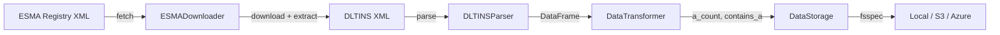

# SteelEye Data Engineer Technical Assessment

ESMA FIRDS ETL pipeline that downloads, parses, transforms, and stores financial instrument data from the European Securities and Markets Authority (ESMA) Financial Instruments Reference Data System (FIRDS).

## Architecture



The pipeline follows a modular design with four components:

- **ESMADownloader** - Fetches the ESMA registry, identifies DLTINS files, downloads and extracts ZIPs
- **DLTINSParser** - Parses DLTINS XML into a pandas DataFrame with instrument attributes
- **DataTransformer** - Adds derived columns (`a_count`, `contains_a`)
- **DataStorage** - Saves CSV output using fsspec for cloud-agnostic storage (S3, Azure Blob, local)

## Requirements

- Python 3.11+
- [uv](https://docs.astral.sh/uv/) for dependency management

## Setup

```bash
git clone https://github.com/Luis-Santos96/steeleye-data-engineer-assessment.git
cd steeleye-data-engineer-assessment
uv sync --all-extras
```

## Usage

Run the pipeline with default configuration:

```bash
uv run python -m steeleye
```

Override settings via CLI arguments:

```bash
uv run python -m steeleye --output output/data.csv --storage-path s3://my-bucket/data.csv --backend s3
```

Or via environment variables:

```bash
export STEELEYE_OUTPUT_PATH=output/data.csv
export STEELEYE_STORAGE_PATH=s3://my-bucket/data.csv
export STEELEYE_STORAGE_BACKEND=s3
uv run python -m steeleye
```

## Development

```bash
make install    # Install dependencies
make lint       # Run ruff linter
make format     # Format code with ruff
make type-check # Run mypy type checking
make test       # Run tests
make test-cov   # Run tests with coverage report
```

Pre-commit hooks are configured for automatic linting and formatting:

```bash
uv run pre-commit install
```

## Testing

```bash
uv run pytest -v                              # Run all tests
uv run pytest tests/unit/ -v                  # Unit tests only
uv run pytest tests/integration/ -v           # Integration tests only
uv run pytest --cov=steeleye --cov-report=term-missing  # With coverage
```

Current coverage: 87% across 28 tests.

## Design Decisions

- **OOP with single-responsibility classes** - Each module handles one step of the pipeline, making components independently testable and reusable.
- **fsspec for storage** - Cloud-agnostic file operations supporting S3, Azure Blob Storage, and local filesystem without code changes.
- **Custom exceptions** - `DownloadError`, `ParsingError`, and `StorageError` provide clear error boundaries across pipeline stages.
- **Configuration via dataclass** - `PipelineConfig` supports both environment variables and CLI arguments, with sensible defaults.
- **lxml over xml.etree** - Better XPath support and performance for large XML documents with namespaces.
- **Mocked external dependencies in tests** - `responses` for HTTP calls, `moto` for S3 - no real network or cloud access needed to run tests.

## Project Structure
src/steeleye/
init.py         # Package version
main.py         # CLI entry point
config.py           # Pipeline configuration
downloader.py       # ESMA registry fetch + ZIP extraction
exceptions.py       # Custom exception hierarchy
parser.py           # DLTINS XML to DataFrame
pipeline.py         # ETL orchestrator
storage.py          # fsspec-based CSV storage
transformer.py      # Derived column logic
tests/
unit/               # Component-level tests
integration/        # End-to-end pipeline test

## Tech Stack

- **pandas** - Data manipulation
- **lxml** - XML parsing
- **requests** - HTTP client
- **boto3** - AWS S3 SDK
- **fsspec / s3fs / adlfs** - Cloud-agnostic file operations
- **pytest / moto / responses** - Testing framework and mocks
- **ruff** - Linting and formatting
- **mypy** - Static type checking
- **uv** - Dependency management
- **GitHub Actions** - CI/CD with automatic releases